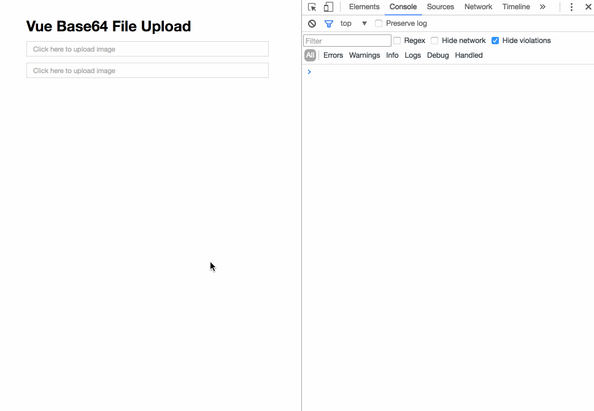

# vue-base64-file-upload

> Upload files as base64 data-uris (URL representing the file's data as a base64 encoded string).



## Install

```bash
npm i vue-base64-file-upload --save
```

## Example

```js
import Vue from 'vue';
import VueBase64FileUpload from 'vue-base64-file-upload';

const app = new Vue({
  components: {
    VueBase64FileUpload
  },

  data() {
    return {
      customImageMaxSize: 3 // megabytes
    };
  },

  methods: {
    onFile(file) {
      console.log(file); // file object
    },

    onLoad(dataUri) {
      console.log(dataUri); // data-uri string
    },

    onSizeExceeded(size) {
      alert(`Image ${size}Mb size exceeds limits of ${this.customImageMaxSize}Mb!`);
    }
  },

  template: `
    <div class="container">
      <h2>Upload file</h2>
      <vue-base64-file-upload 
        class="v1"
        accept="image/png,image/jpeg"
        image-class="v1-image"
        input-class="v1-image"
        :max-size="customImageMaxSize"
        @size-exceeded="onSizeExceeded"
        @file="onFile"
        @load="onLoad" />
    </div>
  `
});

app.$mount('#app');
```

## API

## Props

- `image-class` - pass additional classes for preview `img` tag
- `input-class` - pass additional classes for text `input` tag
- `accept` - mimetypes allowed for upload, _defaults to `'image/png,image/gif,image/jpeg'`_
- `max-size` - number of megabytes allowed for upload, _defaults to `10`_
- `disable-preview` - not show preview image, _defaults to `false`_
- `default-preview` - pass url or data-uri to be displayed as default image
- `file-name` - pass custom filename to be displayed in text `input` tag
- `placeholder` - pass placeholder text for text `input` tag

## Events

- `file` - fired when file object is ready
- `load` - fired when data-uri is ready
- `size-exceeded` - fired if uploaded image size exceeds limits

## References

- [FileReader API](https://developer.mozilla.org/en-US/docs/Web/API/FileReader)
- [`readAsDataURL`](https://developer.mozilla.org/en-US/docs/Web/API/FileReader/readAsDataURL)

---

**MIT Licensed**
